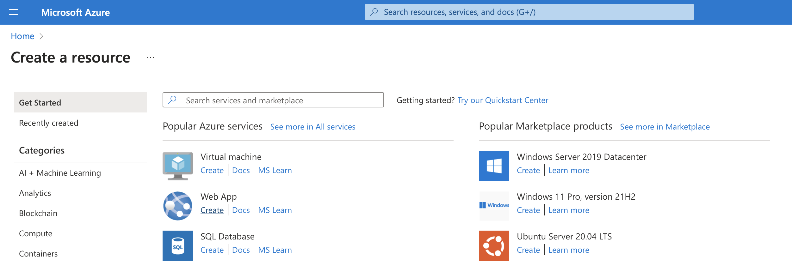
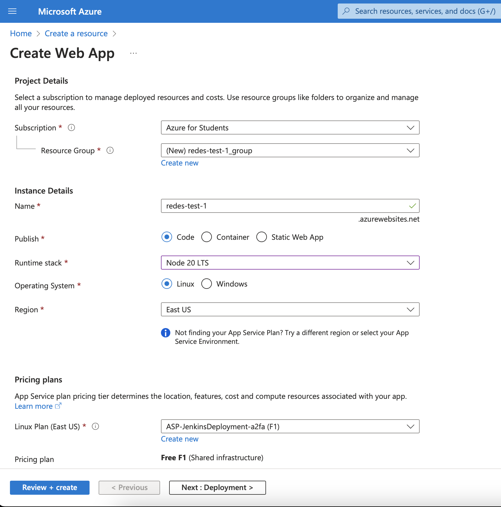
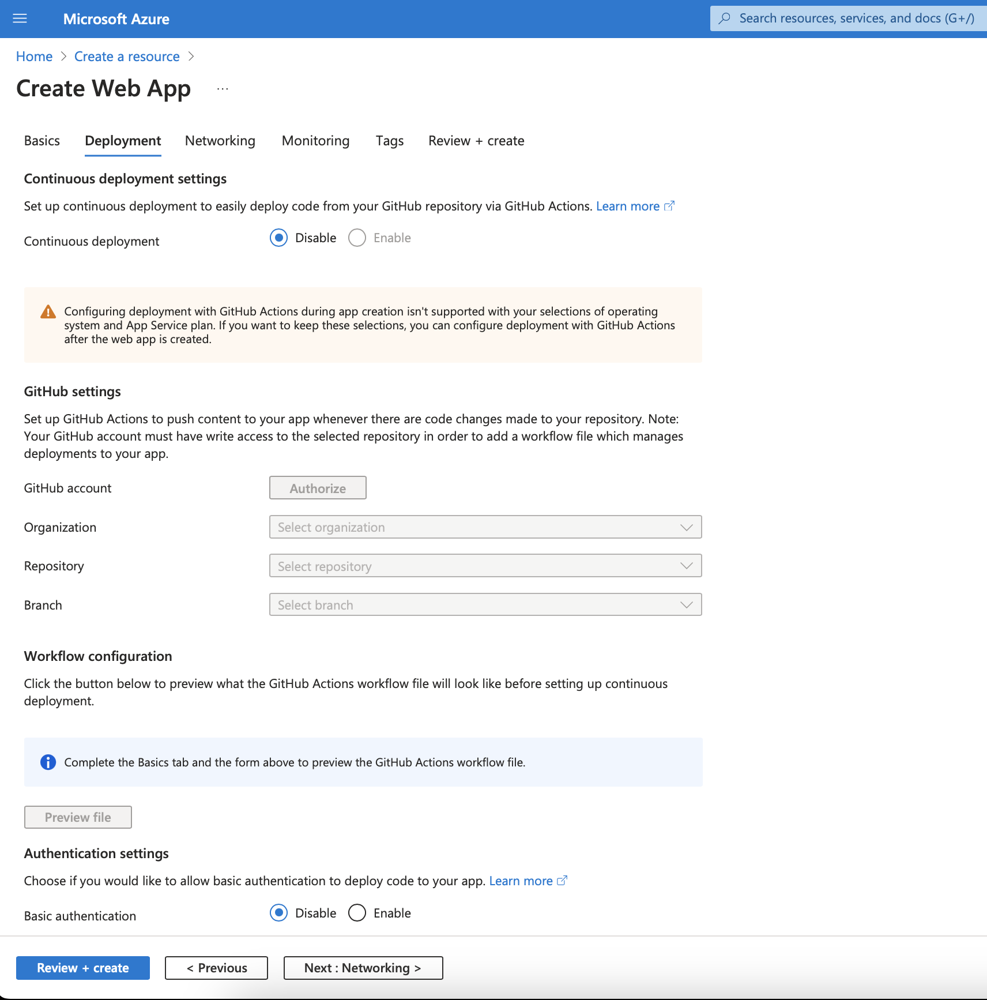
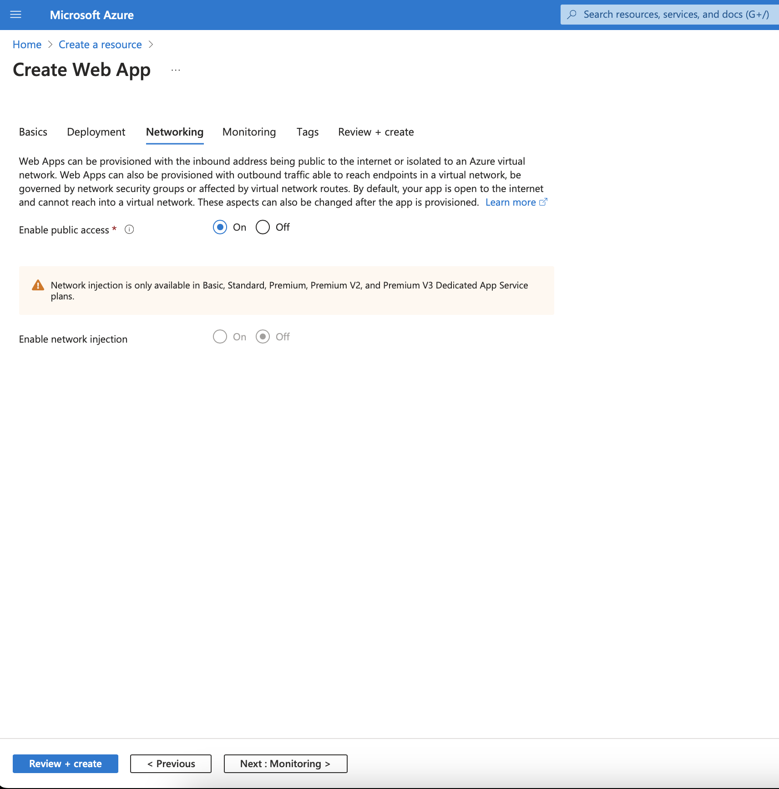
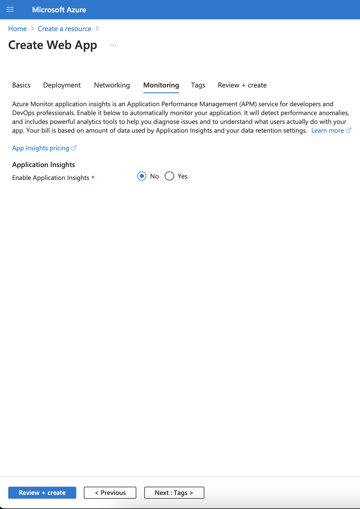
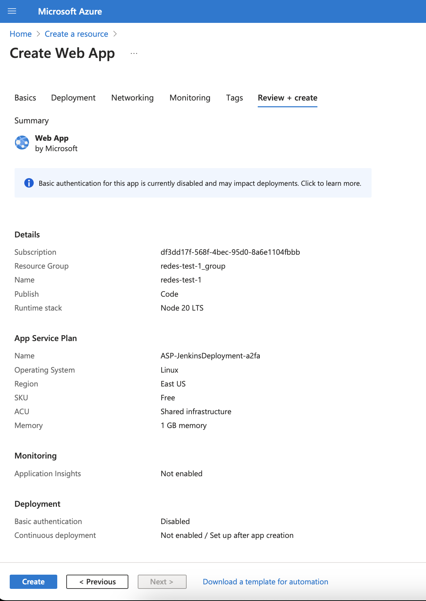

# Configuración de los ambientes de ejecución

Para este proyecto, se decidió utilizar el el servicio de [App Service](https://azure.microsoft.com/es-es/products/app-service) de la plattaforma de [Microsoft Azure](https://azure.microsoft.com/es-es). Este servicio permite la ejecución del código de la aplicación sin encargarse de la configuración, y pagando por los recursos disponibles durante la ejecución.

Se debe crear un App Service para cada entorno, es decir uno para develop y otro para producción. A continuación, se explica cómo crear uno de ellos. 

## Creación del App Service
Para empezar, buscar el menú para crear un recurso en la consola y hacer click en el botón _crear_ de _Web App_.



Luego, en la pantalla de detalles

1. En _Subscription_ elegir la subscripción donde se quiere levantar el servicio. 
2. En _Resource Group_ hacer click en el botón de _Create new_ y elegir un nuevo nombre para el grupo de recursos. Si no se completa, se creará un grupo nuevo con el nombre basado en el siguiente paso.
3. En _Instance Details_
    1. Completar con un nombre en el campo _Name_
    2. En _Publish_, elegir la opción de _Code_
    3. En _Runtime stack_, elegir la opción de _Node 20 LTS_, que es la versión requerida para este proyecto
    4. En _Operating System_, elegir _Linux_.
    5. En _Region_, elegir una región donde se va a crear el recurso (por ejemplo, `East US`)
4. En Pricing Plans
    1. Hacer click en el botón _Create new_ y asignarle un nombre al plan para el App service.
    2. En _Pricing plan_, elegir una de las opciones provistas. Para esta prueba, se elige _Free F1 (Shared infrastructure)_



> [!NOTE]
> Los nombres para _Resource group_ y _Instance Details_ serán utilizados luego para el proceso de deployment.

Al hacer click en _Next_, en la pantalla de _Deployment_, seleccionar la opción de _Disable_ para _Continuous deployment_ y para _Authentication settings_



Luego, hacer click en _Next_. En la pantalla de _Networking_ elegir la opción de _On_ para _Enable public access_ 



Después, en la pantalla de _Monitoring_, seleccionar _No_ para _Enable Application Insights_



En la ventana de _Tags_ no hacer cambios y revisar todo en la pantalla de _Review + Create_. Para terminar con la creación, hacer click en el botón _Cretate_



Finalmente, en la pantalla con el detalle del recurso, ir a Setting > Configuration. Ahí, cambiar el _Startup Command_ con `node .next/standalone/server.js`.

## Deploy en Pipeline

Para realizar el deploy de una manera genérica, se utilizará la CLI de Azure desde el pipeline. Por las limitaciones de las cuentas para estudiantes, se utilizarán las credenciales de usuario para hacer el deploy, pero esto ***no es recomendable para un proyecto serio***, ya que se deberían usar roles más específicos para limitar el acceso. Para más información, se puede consultar sobre los [roles](https://learn.microsoft.com/es-mx/azure/role-based-access-control/role-assignments-portal), los [service principal](https://learn.microsoft.com/en-us/entra/identity-platform/app-objects-and-service-principals?tabs=browser) y el uso de la [CLI](https://learn.microsoft.com/en-us/cli/azure/authenticate-azure-cli-service-principal) con esos usuarios.

El código para el deploy en el pipeline es el siguiente
```groovy
sh 'npm run build'
sh 'cp -r .next/static .next/standalone/.next/static'
sh 'cp -r public .next/standalone/public'
sh 'zip deploy .next -qr'

withCredentials([usernamePassword(credentialsId: 'azure-jose', passwordVariable: 'AZURE_CLIENT_SECRET', usernameVariable: 'AZURE_CLIENT_ID')]) {
    sh 'az login -u $AZURE_CLIENT_ID -p $AZURE_CLIENT_SECRET > /dev/null'
}

withEnv(['RESOURCE_GROUP_NAME=Jenkins-Deployment',
                            'WEB_APP_NAME=redes-jenkins-deploy']) {
    sh 'az webapp deploy --resource-group $RESOURCE_GROUP_NAME --name $WEB_APP_NAME --src-path deploy.zip --type zip --clean true'
}
```
Lo que hace es:
1. Preparar el proyecto para ejecutarlo con node y crear un archivo `.zip` con el contenido
2. Loguearse con la CLI de Azure utilizando las credenciales guardadas en la [configuración de Jenkins](Jenkins.md#username-password).
3. Subir el archivo generado en el paso 1, especificando las variables `RESOURCE_GROUP_NAME` y `WEB_APP_NAME` con los valores obtenidos en la [creación del servicio](Deploy#creación-del-app-service).

Para más información sobre el uso de la CLI de azure para hacer el deploy, mirar [este link](https://learn.microsoft.com/en-us/cli/azure/webapp?view=azure-cli-latest#az-webapp-deploy).