# Configuración de Jenkins

Para poder ejecutar un pipeline de Jenkins es necesario configurar un servidor Jenkins, donde se van a ejecutar los pasos del Jenkinsfile. 

## Instalación
Se utilizará una VM con Ubuntu Server en la versión [22.04.4 LTS](https://releases.ubuntu.com/jammy/), y se recomienda una VM con al menos 2 vCUP y 4 GiB de RAM para correr los trabajos. Para poder tener una IP pública (necesario para utilizar webhooks para iniciar los pipelines), se utilizó el servicio de Azure VM's para crear las VM's necesarias (pudiendo cambiarse por otros servicios como AWS EC2). 

Una vez que se haya levantado la VM, se deben ejecutar los siguientes comandos para instalar Jenkins y Docker, que será utilizado para crear el ambiente de ejecución de los pipelines. 
1. Instalar Java 
```bash
sudo apt install openjdk-17-jdk openjdk-17-jre
```
Podemos verificar si se completó la instalación con 
```bash
java -version
```
2. Instalar Jenkins
```bash
sudo wget -O /usr/share/keyrings/jenkins-keyring.asc \
  https://pkg.jenkins.io/debian-stable/jenkins.io-2023.key
echo "deb [signed-by=/usr/share/keyrings/jenkins-keyring.asc]" \
  https://pkg.jenkins.io/debian-stable binary/ | sudo tee \
  /etc/apt/sources.list.d/jenkins.list > /dev/null
sudo apt-get update
sudo apt-get install jenkins
```
3. Instalar Docker
```bash
sudo apt update
sudo apt install apt-transport-https ca-certificates curl software-properties-common
curl -fsSL https://download.docker.com/linux/ubuntu/gpg | sudo apt-key add -
sudo add-apt-repository "deb [arch=amd64] https://download.docker.com/linux/ubuntu focal stable"
sudo apt install docker-ce
```
4. Configurar para que Jenkins se inicie cuando se inicia la máquina
```bash
sudo systemctl enable jenkins
```
5. Iniciar Jenkins
```bash
sudo systemctl start jenkins
```
6. Configurar para que Docker inicie cuando se inicia la máquina
```bash
sudo systemctl enable docker
```
7. Iniciar Docker
```bash
sudo systemctl start docker
```
## Configuración inicial
Para la configuración de Jenkins, se utilizará la página web que provee el servidor en el puerto `8080` por default. Es necesario que desde la configuración de la VM se permitan conexiones a dicho puerto. Los pasos a ejecutar son:

1. Desbloquear Jenkins:

Luego de la instalación, es necesario buscar una clave generada por Jenkins para verificar que el usuario de la página es el administrador. Dicha clave se encuentra en `/var/lib/jenkins/secrets/initialAdminPassword`, y para conocerla se ejecuta
```bash
cat /var/lib/jenkins/secrets/initialAdminPassword
```
Luego, se debe copiar la clave en la página

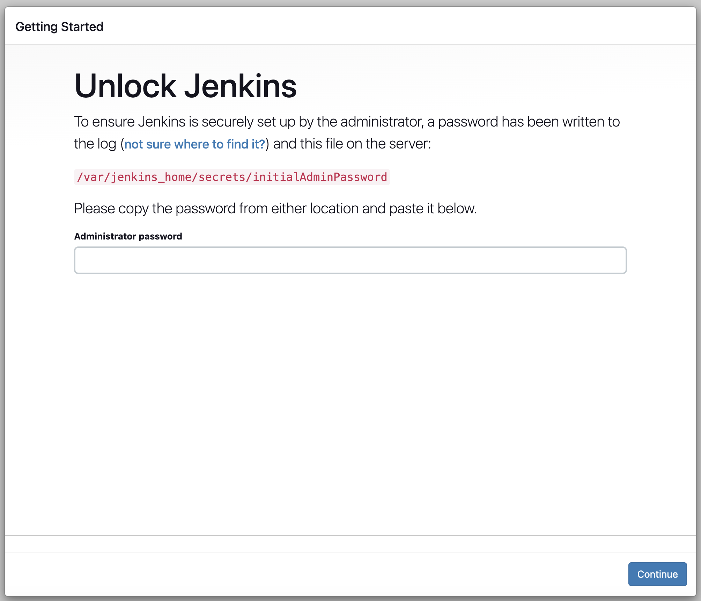

2. Instalar plugins sugeridos

Para acelerar la configuración, vamos a instalar algunos plugins que se utilizan comúnmente. 

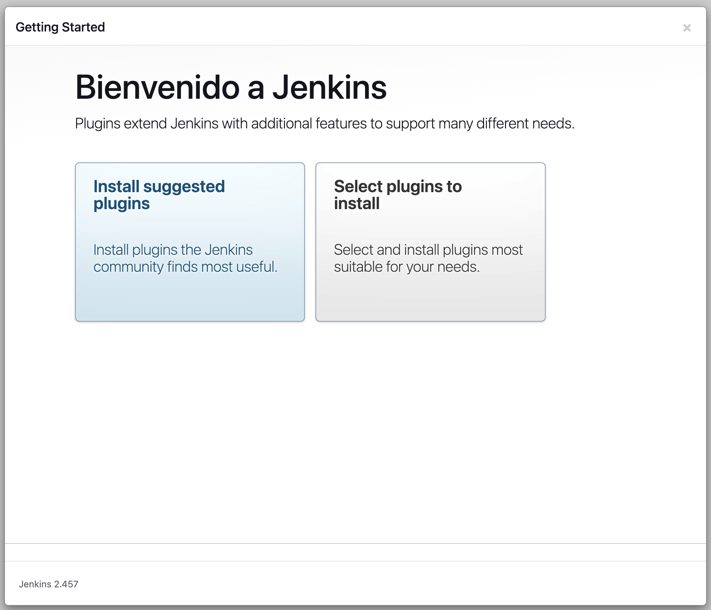

3. Crear usuario administrador

Luego, se debe crear el primer usuario administrador para jenkins, especificando:

- Username
- Contraseña
- Nombre completo
- Email

Este usuario será utilizado para configurar los plugins posteriormente. 

4. Configurar el URL de Jenkins

Para poder enviar URL's para acceder a Jenkins (por ejemplo, para aprobar o rechazar un deploy), se debe configurar el URL bajo el cual corre el servidor. 


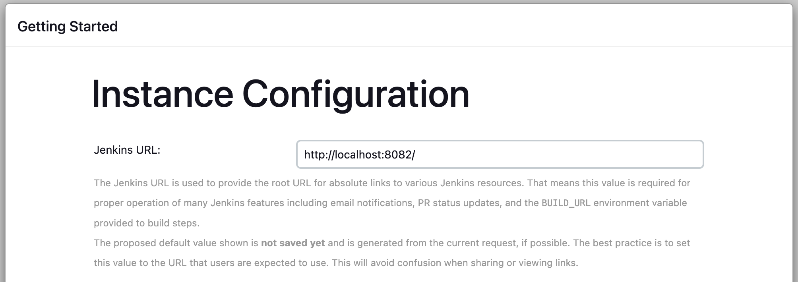


## Plugins
Además de los plugins comunes que se instalaron anteriormente, Jenkins ofrece una gran variedad de plugins para extender las funcionalidades de los pipelines. En nuestro caso, se van a usar:

- [Slack Notification](https://plugins.jenkins.io/slack/)
- [Docker Pipeline](https://plugins.jenkins.io/docker-workflow/)
- [Jira](https://plugins.jenkins.io/jira/)


Para instalarlos, vamos a Panel de Control > Administar Jenkins > Plugins y seleccionamos la opción de en  _Available plugins_ . También se puede navegar directamente a `<jenkins_url>/manage/pluginManager/available`

Luego, en el buscador, buscamos los plugins que deseamos instalar y los marcamos


Tocamos instalar y en la página de instalación, marcamos la opción para reiniciar el servidor luego de la instalación


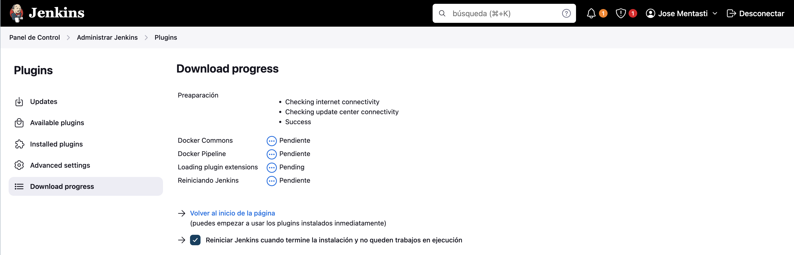


## Configuración de credenciales

Se deben configurar credenciales para:

1. Acceder al repositorio (en este caso, hosteado en Github)
2. Enviar emails 
3. Acceder al servidor de Slack 
4. Utilizar los servicios de Azure
5. Utilizar Jira 

 Para eso, vamos a Panel de Control > Administrar Jenkins > Credentials > System > Global credentials (unrestricted). También se puede navegar directamente a 
`<jenkins_url>/manage/credentials/store/system/domain/_/`

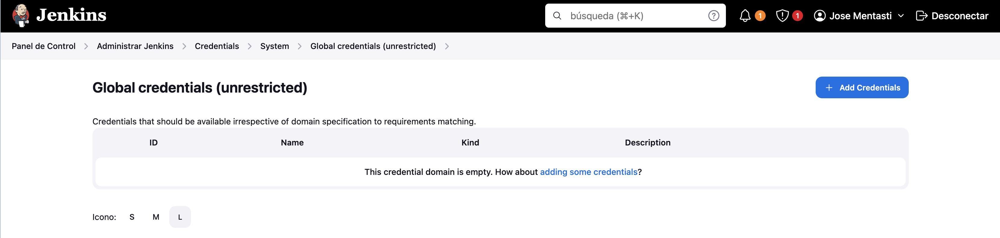


### Username-Password

Para los casos de Github, emails, Azure y Jira, se debe configurar una credencial de tipo Username-Password. Para eso, en el panel de credenciales, tocar el botón _Add Credentials_ y elegir la opción de _Username with password_ 

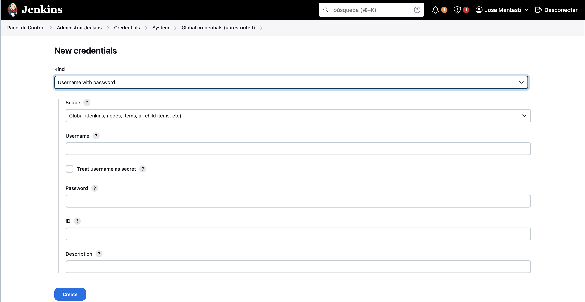


#### Github

Para el acceso al repositorio, se puede configurar un _fine-grained token_ para limitar el acceso al repositorio que se quiere vincular al pipeline. Para mas información, consultar [este link](https://docs.github.com/en/authentication/keeping-your-account-and-data-secure/managing-your-personal-access-tokens#creating-a-fine-grained-personal-access-token).

Los permisos que recomendamos darle al Token para el repositorio del proyecto son: (TODO revisar para bajarlos)
- Actions: Read and Write
- Code scanning alerts: Read and Write
- Commit statuses: Read and Write
- Contents: Read and Write
- Deployments: Read and Write
- Issues: Read and Write
- Metadata: Read-only
- Pull Requests: Read and Write
- Webhooks: Read and Write

#### Emails

Para el servicio de emails, se puede utilizar una cuenta de Gmail, pero en las credenciales se debe usar un _App Password_ como contraseña. Para más información, consultar [este link](https://support.google.com/accounts/answer/185833?sjid=17107983271934554516-SA)


#### Jira

Para utilizar el plugin de Jira, es necesario crear un API Token para un workspace. Para eso:
1. Crear un workspace en Jira
2. Ir a https://id.atlassian.com/manage-profile/security/api-tokens 
3. Hacer click en _Crear Api Token_, asignarle un identificador y copiar el token generado (no se va a volver a mostrar)
4. Crear una credencial donde
    - username: email de quien creó el token
    - password: api token  


### Secret

Para utilizar el servicio de Slack, se debe crear una credencial de tipo _Secret text_. Para eso, en el panel de credenciales, tocar el botón _Add Credentials_ y elegir la opción de _Secret text_

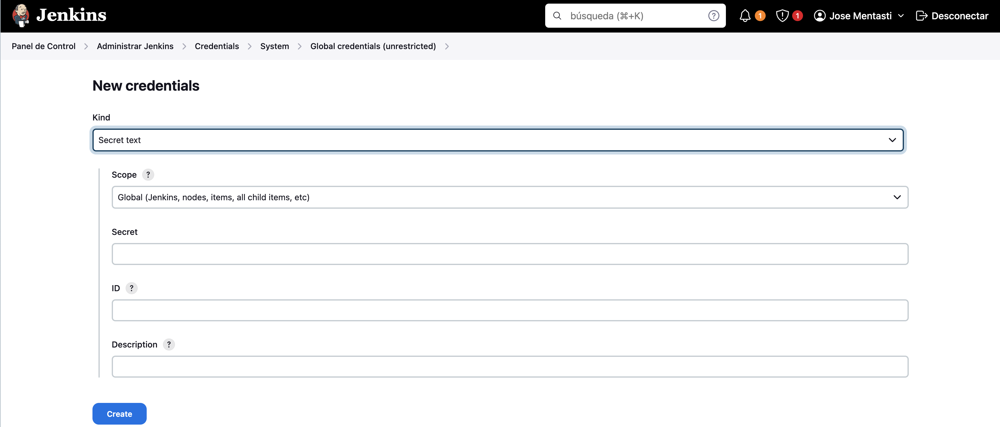


#### Slack

Para obtener un token en Slack, vamos a configurar un workspace nuevo para el equipo de desarrollo. Para eso, se deben seguir los siguientes pasos:

1. Crear un workspace en Slack
2. Hacer un canal #deploy (que se usará para mandar las novedades del pipeline)
3. Generar token del bot
    1. Ir a https://api.slack.com/apps
    2. Tocar el botón _Create an App_
    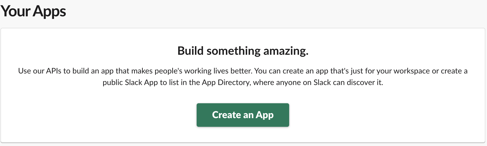
    3. Elegir la opción _From an app manifest_
    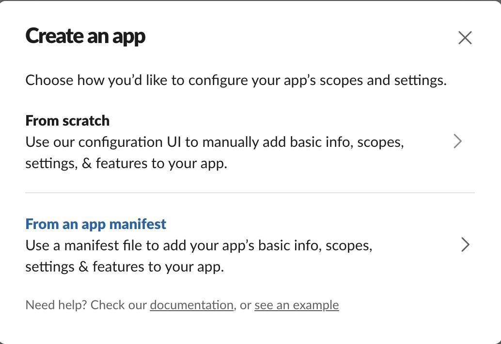
    4. Elegir el workspace creado 
    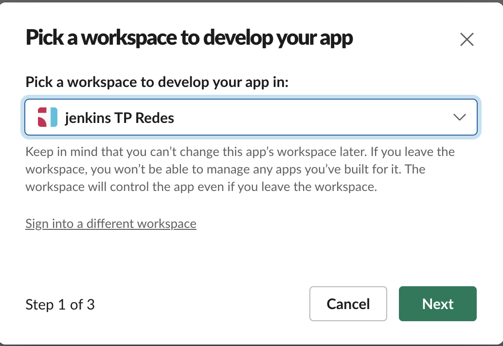
        5. Eliminar el contenido del yaml creado, elegir el formato yaml y copiar el siguiente contenido
        ```yaml
        display_information:
          name: Jenkins
        features:
          bot_user:
            display_name: Jenkins
            always_online: true
        oauth_config:
          scopes:
            bot:
              - channels:read
              - chat:write
              - chat:write.customize
              - files:write
              - reactions:write
              - users:read
              - users:read.email
              - groups:read
        settings:
          org_deploy_enabled: false
          socket_mode_enabled: false
          token_rotation_enabled: false
        ```
    5. Clickear _Next_ > _Create_ > _Install app to workspace_ > _Allow_
    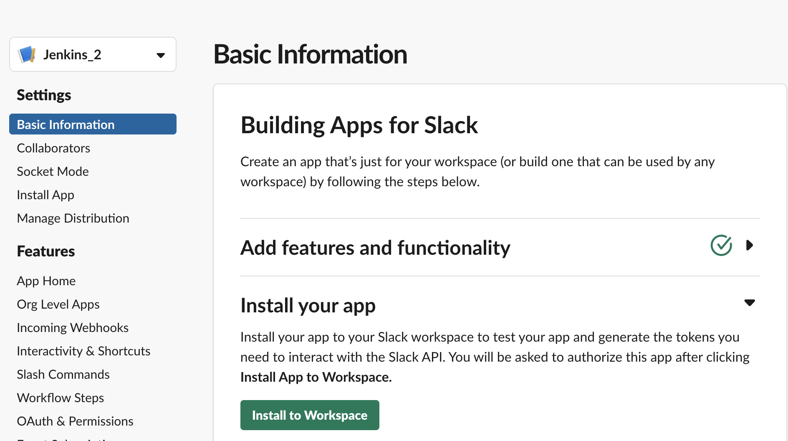 

       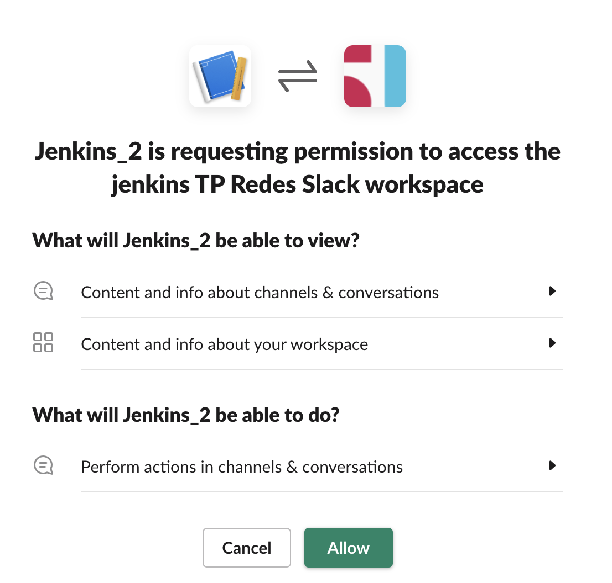
    6. En la página de la aplicación, ir a _OAuth & Permissions_ y obtener el token que se utilizará para las credenciales
    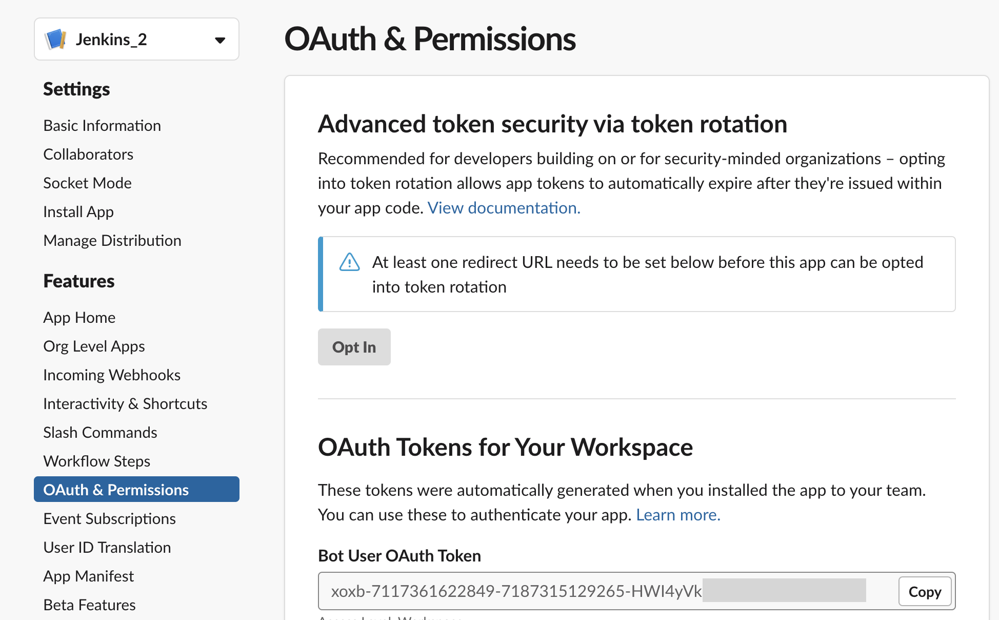  


## Configuración de plugins

Luego de instalar los plugins, se deben configurar para usar los servicios creados. Esto se puede hacer en Panel de Control > Administrar Jenkins > System, navegando a `<jenkins_url>/manage/configure`

### Slack

Lo primero que se debe hacer es agregar a la aplicación configurada previamente al canal #deploy. Para eso, hacer click en la configuración del canal, ir a _Integrations_ y clickear _Add apps_

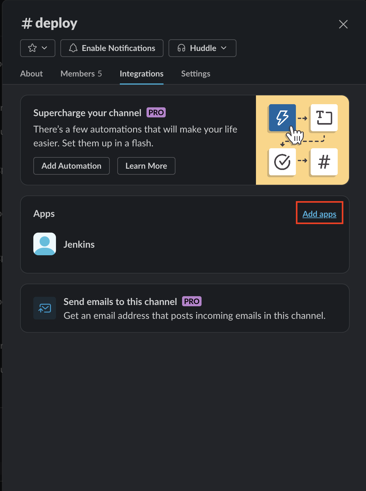  

En la lista, elegir a la aplicación creada previamente. 

Luego, en la configuración de Jenkins, ir a la sección de _Slack_ y
 - Completar el campo _Workspace_ con el nombre del workspace utilizado. Por ejemplo, si es `jenkinstpredes.slack.com`, completar el campo con `jenkinstpredes`
 - Elegir en el campo _Credential_ al id de la credencial para Slack creada [anteriormente](Jenkins.md#slack). 
 - En el campo _Default channel / member id_, indicar el valor del canal a utilizar como defecto (en este caso, `#deploy`)
 - Marcar la opción _Custom slack app bot user_
    - Elegir el emoji como icono para el bot (puede ser `:robot_face:`)
    - Elegir un username (como `Jenkins`)

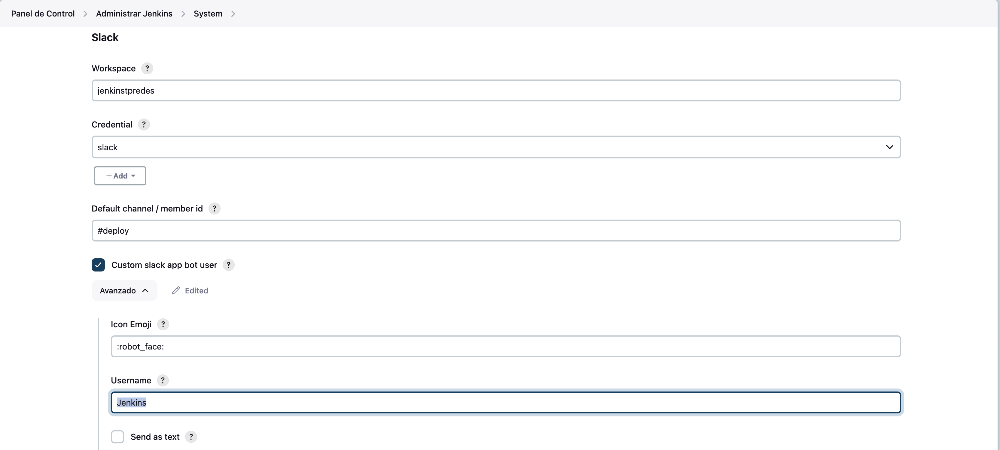  

### Emails

En primer lugar, en la sección de _Jenkins Location_, modificar el campo _System Admin e-mail address_ para personalizar el header _From_ de los emails enviados. 

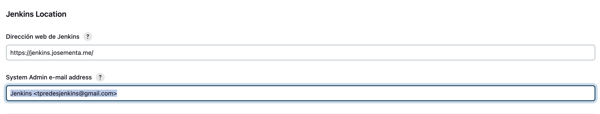  

Luego, ir a la sección de _Extended E-mail Notification_ y configurar

- SMTP server: `smtp.gmail.com`
- SMTP port: `465`

Después, ir a _Avanzado_ y en el campo de credenciales, elegir el id de la credencial de email configurada [previamente](Jenkins.md#emails). También, marcar la opción de _Use SSL_.

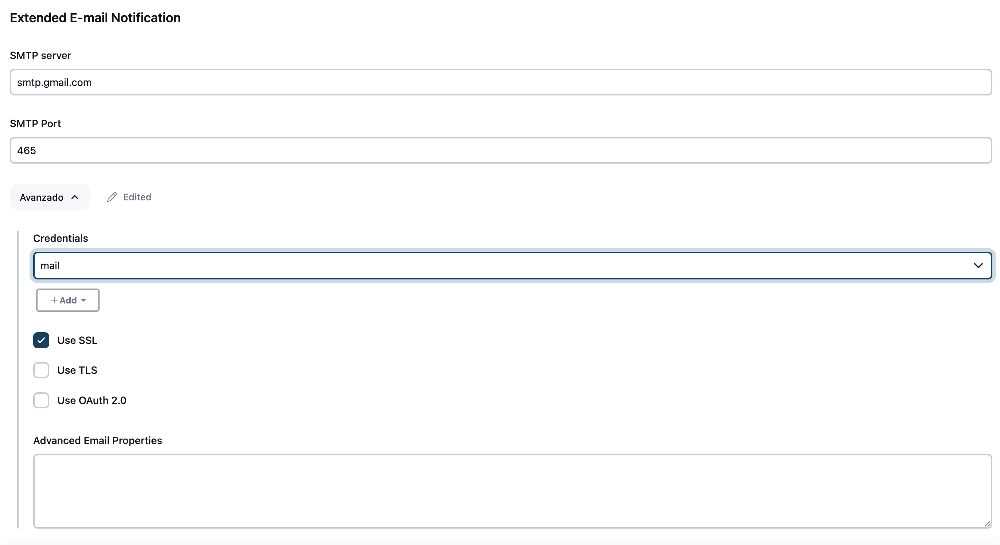  


### Jira

En la sección de _Jira_

1. Hacer click en el botón _Añadir_
2. Agregar la URL del workspace en el campo _URL_
3. En _Credentials_, elegir las credenciales creadas [anteriormente](Jenkins.md#jira)

Para poder crear Issues de tipo error en el workspace de Jira, ir a Jira > Tipos de Incidencias > Añadir tipo de incidencia > Crear tipo de incidencia > Nombre: `JenkinsError`

## Opcional: Configuración de Nodos

Una de las ventajas que ofrece Jenkins es la posibilidad de escalar horizontalmente, teniendo un controlador que distribuye tareas en nodos para su procesamiento. A continuación, se muestran los pasos para crear un nodo y asociarlo al controlador de Jenkins creado. 

> [!NOTE]
> No es necesario configurar builds distribuidos para utilizar Jenkins, los pipelines pueden ser ejecutados por el controlador. 

Para la demostración, nuevamente se utilizará una VM con Ubuntu Server en la versión [22.04.4 LTS](https://releases.ubuntu.com/jammy/), y se recomienda una VM con al menos 2 vCUP y 4 GiB de RAM para correr los trabajos. 

Para empezar, en la VM del controlador:
1. Ir a Panel de Control > Administrar Jenkins > nodos (o navegar a `<jenkins_url>/manage/computer/`) y hacer click en _New Node_.

 

2. Elegir un nombre para el nodo y seleccionar la opción de _Permanent Agent_. Luego, hacer click en el botón _Create_.

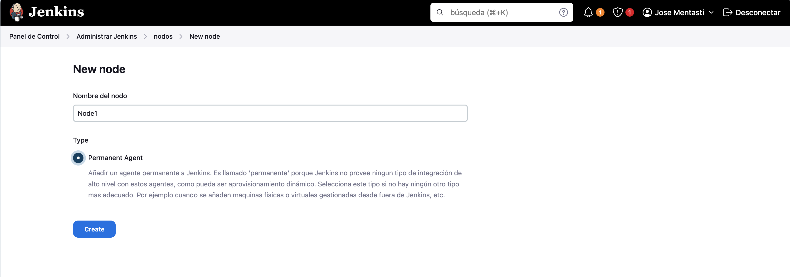 

3. En la pantalla de detalles
    1. Especificar una descripción para el nodo
    2. Especificar el número de ejecutores en el nodo, donde un valor inicial recomendado es la cantidad de cores disponibles.
    3. En _Directorio raíz remoto_, indicar el directorio en donde se quiere instalar el controlador (en este caso, `/home/jenkins`)
    4. Para _Usar_, elegir la opción de _Utilizar este nodo tanto como sea posible_
    5. Para _Metodo de ejeución_, elegir la opción de _Launch agent by connecting it to the controller_

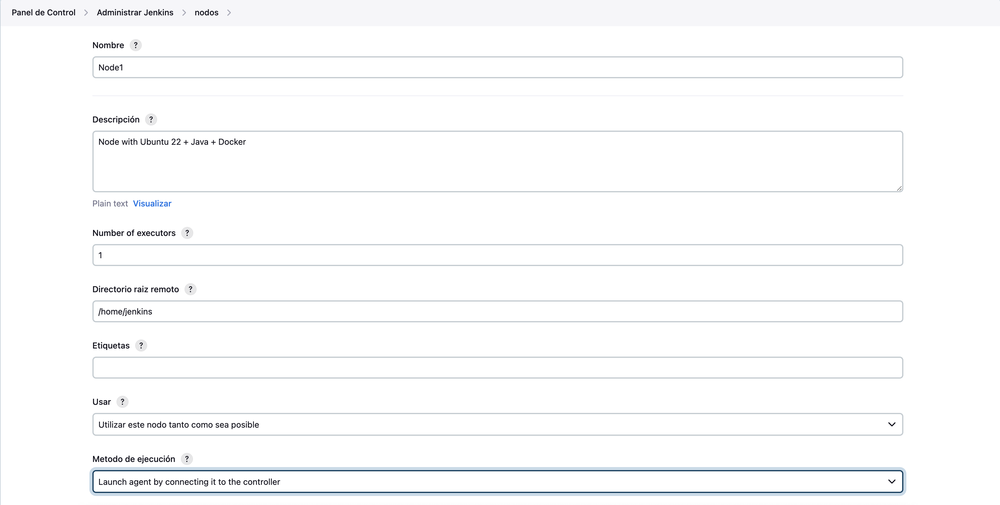 

4. Hacer click en _Guardar_ y entrar al nodo recién agregado

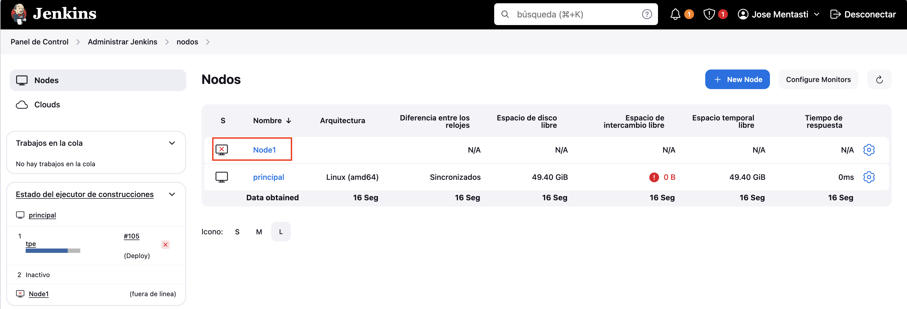 

5. Guardar los comandos en la opción de _Run from agent command line (Unix)_, lo vamos a usar luego.  

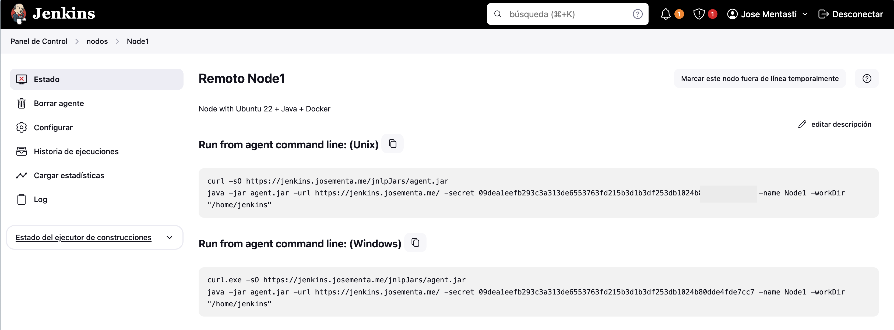 

6. Habilitar que Jenkins utilice un puerto para comunicarse con el agente, en Panel de Control > Administrar Jenkins > Security (o navegando a `<jenkins_url>/manage/configureSecurity/`) y seleccionando _Fijo_ o _Aleatorio_ en la sección de _Agents_

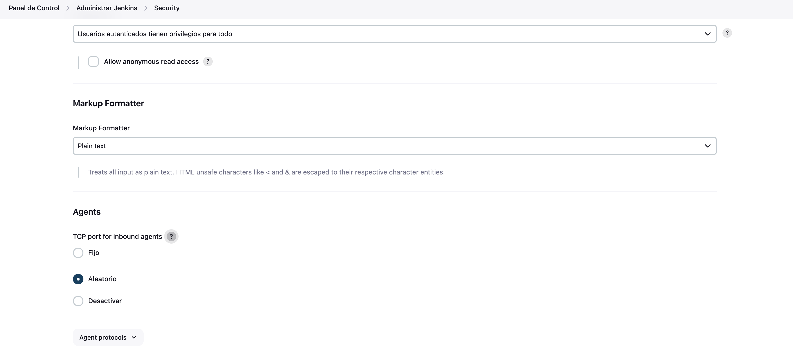 

> [!WARNING]
> Se recomienda actualizar las reglas de seguridad para permitir conexiones entrantes y salientes al agente y nodo para lo configurado en el paso 6. Se puede habilitar las conexiones para IP's dentro de la LAN privada de las VM's para simplificar la configuración. 


Luego, en la VM para el nodo:
1. Instalar Java y Docker, como se muestra en [estos pasos](Jenkins.md#instalación).
2. Crear un usuario para el agente, al que se le van a dar los privilegios necesarios para correr los pipelines.
    ```bash
    sudo useradd -m -d /home/jenkins -s /bin/bash jenkins
    ```
3. Dejar que el nuevo usuario pueda correr Docker
    ```bash
    sudo usermod -aG docker jenkins
    ```
4. Descargar el `jar` para el agente
    ```bash
    curl -sO <jenkins_url>/jnlpJars/agent.jar
    ```
    Este es el primer comando del paso 5
5. Crear un directorio para el servicio
    ```bash
    sudo mkdir -p /usr/local/jenkins-service
    ```
6. Mover el agente a ese directorio
    ```bash
    sudo mv agent.jar /usr/local/jenkins-service
    ```
7. En el directorio, crear el archivo `start-agent.sh` y agregarle el siguiente contenido, que se va a utilizar para levantar el servicio
    ```bash
    #!/bin/bash
    cd /usr/local/jenkins-service
    curl -sO <jenkins_url>/jnlpJars/agent.jar
    # curl -sO http://10.0.0.5:8080/jnlpJars/agent.jar
    java -jar agent.jar -url <jenkins_url> -secret 
    # java -jar agent.jar -url http://10.0.0.5:8080/ -secret ... -name Node1 -workDir "/home/jenkins"
    <my_secret> -name Node1 -workDir "/home/jenkins"
    exit 0
    ```
    Donde las líneas 3 y 5 son las obtenidas en el paso y de la configuración del controlador (pudiendo cambiar el host para usar IP's privadas)
8. Darle permisos de ejecución al archivo
      ```bash
      sudo chmod +x start-agent.sh 
      ```
9. Crear el archivo `/etc/systemd/system/jenkins-agent.service` y agregarle el siguiente contenido
    ```bash
    [Unit]
    Description=Jenkins Agent

    [Service]
    User=jenkins
    WorkingDirectory=/home/jenkins
    ExecStart=/bin/bash /usr/local/jenkins-service/start-agent.sh
    Restart=always

    [Install]
    WantedBy=multi-user.target
    ```
10. Habilitar al servicio para correr cuando se inicia la VM
    ```bash
    sudo systemctl enable jenkins-agent.service
    ```
11. Iniciar el servicio
    ```bash
    sudo systemctl start jenkins-agent.service
    ```