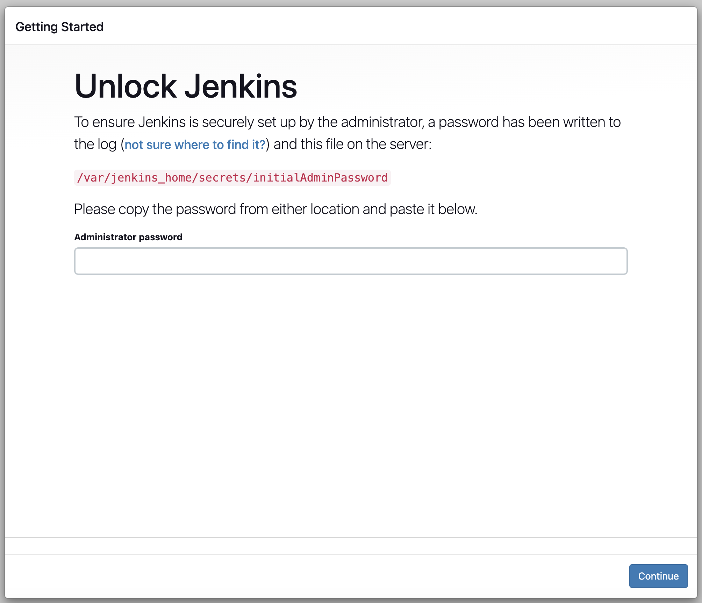
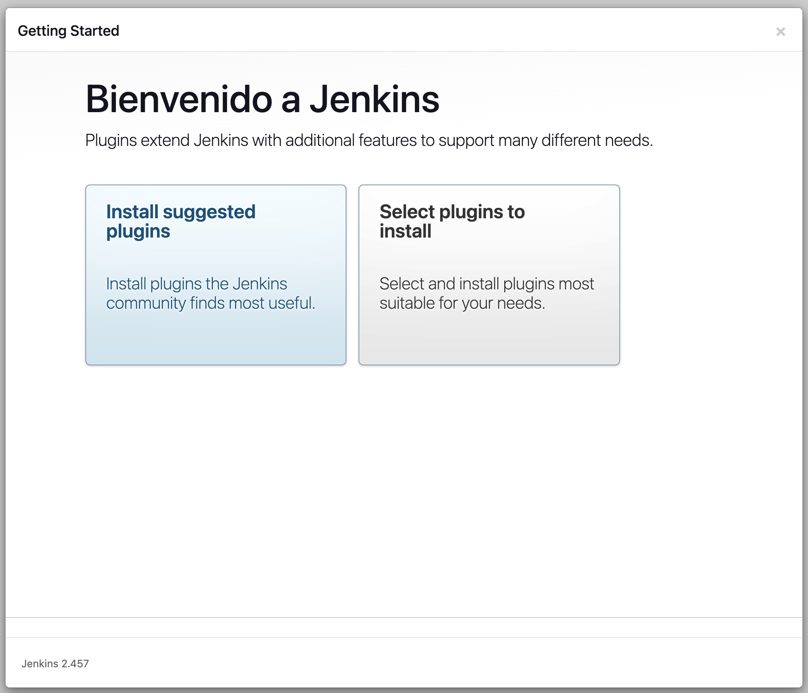
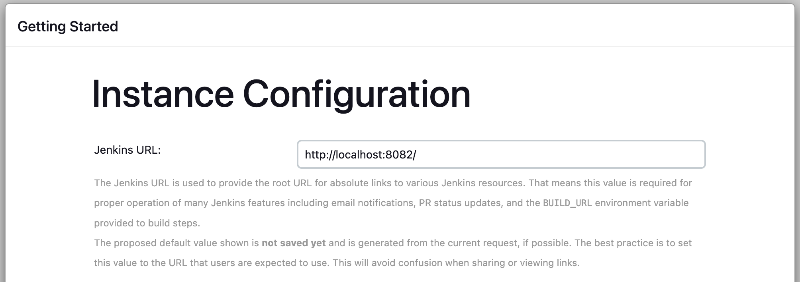
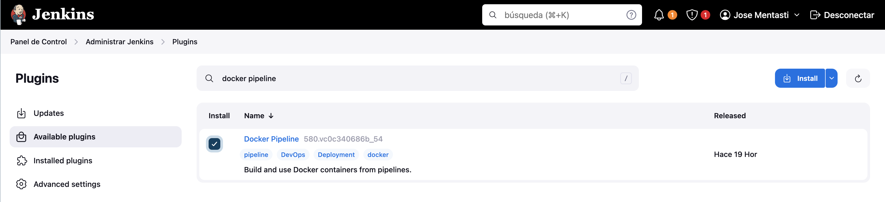
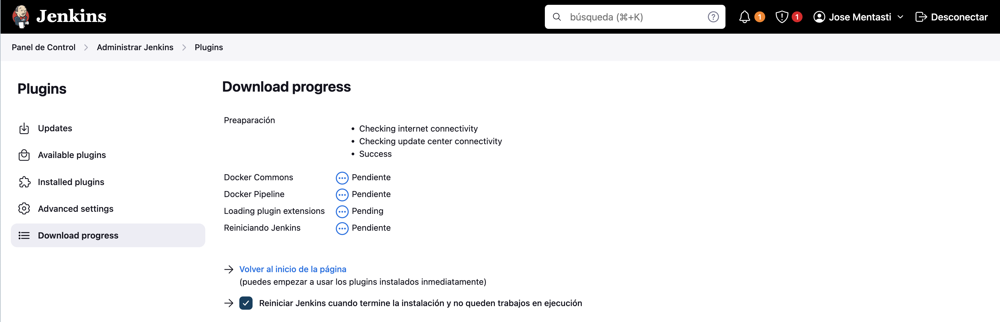

# Configuración de Jenkins

Para poder ejecutar un pipeline de Jenkins es necesario configurar un servidor Jenkins, donde se van a ejecutar los pasos del Jenkinsfile. 

### TODO: cambiar si agregamos un slave para ejecutar los pasos

## Instalación
Se utilizará una VM con Ubuntu Server en la versión [22.04.4 LTS](https://releases.ubuntu.com/jammy/), y se recomienda una VM con al menos 2 vCUP y 4 GiB de RAM para correr los trabajos. Para poder tener una IP pública (necesario para utilizar webhooks para iniciar los pipelines), se utilizó el servicio de Azure VM's para crear las VM's necesarias (pudiendo cambiarse por otros servicios como AWS EC2). 

Una vez que se haya levantado la VM, se deben ejecutar los siguientes comandos para instalar Jenkins y Docker, que será utilizado para crear el ambiente de ejecución de los pipelines. 
1. Instalar Java 
```bash
sudo apt install openjdk-17-jdk openjdk-17-jre
```
Podemos verificar si se completó la instalación con 
```bash
java -version
```
2. Instalar Jenkins
```bash
sudo wget -O /usr/share/keyrings/jenkins-keyring.asc \
  https://pkg.jenkins.io/debian-stable/jenkins.io-2023.key
echo "deb [signed-by=/usr/share/keyrings/jenkins-keyring.asc]" \
  https://pkg.jenkins.io/debian-stable binary/ | sudo tee \
  /etc/apt/sources.list.d/jenkins.list > /dev/null
sudo apt-get update
sudo apt-get install jenkins
```
3. Instalar Docker
```bash
sudo apt update
sudo apt install apt-transport-https ca-certificates curl software-properties-common
curl -fsSL https://download.docker.com/linux/ubuntu/gpg | sudo apt-key add -
sudo add-apt-repository "deb [arch=amd64] https://download.docker.com/linux/ubuntu focal stable"
sudo apt install docker-ce
```
4. Configurar para que Jenkins se inicie cuando se inicia la máquina
```bash
sudo systemctl enable jenkins
```
5. Iniciar Jenkins
```bash
sudo systemctl start jenkins
```
6. Configurar para que Docker inicie cuando se inicia la máquina
```bash
sudo systemctl enable docker
```
7. Iniciar Docker
```bash
sudo systemctl start docker
```
## Configuración 
Para la configuración de Jenkins, se utilizará la página web que provee el servidor en el puerto `8080` por default. Es necesario que desde la configuración de la VM se permitan conexiones a dicho puerto. Los pasos a ejecutar son:

1. Desbloquear Jenkins:

Luego de la instalación, es necesario buscar una clave generada por Jenkins para verificar que el usuario de la página es el administrador. Dicha clave se encuentra en `/var/lib/jenkins/secrets/initialAdminPassword`, y para conocerla se ejecuta
```bash
cat /var/lib/jenkins/secrets/initialAdminPassword
```
Luego, se debe copiar la clave en la página



2. Instalar plugins sugeridos

Para acelerar la configuración, vamos a instalar algunos plugins que se utilizan comúnmente. 



3. Crear usuario administrador

Luego, se debe crear el primer usuario administrador para jenkins, especificando:

- Username
- Contraseña
- Nombre completo
- Email

Este usuario será utilizado para configurar los plugins posteriormente. 

4. Configurar el URL de Jenkins

Para poder enviar URL's para acceder a Jenkins (por ejemplo, para aprobar o rechazar un deploy), se debe configurar el URL bajo el cual corre el servidor. 





## Plugins
Además de los plugins comunes que se instalaron anteriormente, Jenkins ofrece una gran variedad de plugins para extender las funcionalidades de los pipelines. En nuestro caso, se van a usar:

- [Slack Notification](https://plugins.jenkins.io/slack/)
- [Docker Pipeline](https://plugins.jenkins.io/docker-workflow/)


Para instalarlos, vamos a Panel de Control > Administar Jenkins > Plugins y seleccionamos la opción de en  _Available plugins_ . También se puede navegar directamente a `<jenkins_url>/manage/pluginManager/available`

Luego, en el buscador, buscamos los plugins que deseamos instalar y los marcamos



Tocamos instalar y en la página de instalación, marcamos la opción para reiniciar el servidor luego de la instalación





## Credenciales

Se deben configurar credenciales para:

1. Acceder al repositorio (en este caso, hosteado en Github)
2. Enviar emails 
3. Acceder al servidor de Slack 
4. Utilizar los servicios de Azure
5. Utilizar Jira 

### Username-Password

Para los casos de Github, emails, Slack y Jira, se debe configurar una credencial de tipo Username-Password. 


#### Github

Para el acceso al repositorio, se puede configurar un _fine-grained token_ para limitar el acceso al repositorio que se quiere vincular al pipeline. Para mas información, consultar [este link](https://docs.github.com/en/authentication/keeping-your-account-and-data-secure/managing-your-personal-access-tokens#creating-a-fine-grained-personal-access-token).

#### Emails

Para el servicio de emails, se puede utilizar una cuenta de Gmail, pero en las credenciales se debe usar un _App Password_ como contraseña. Para más información, consultar [este link](https://support.google.com/accounts/answer/185833?sjid=17107983271934554516-SA)


#### Jira

TODO


### Secret
