# Configuración del pipeline

Luego de configurar el servidor de Jenkins, podemos empezar a configurar los pipelines para el proyecto. Además, se configurará el repositorio (en este caso, en [Github](http://github.com))

## Pipeline para main branch

Para configurar el pipeline encargado de buildear, testear y finalmente hacer el deploy del proyecto, se debe configurar una nueva tarea de Jenkins en el Panel de Control.

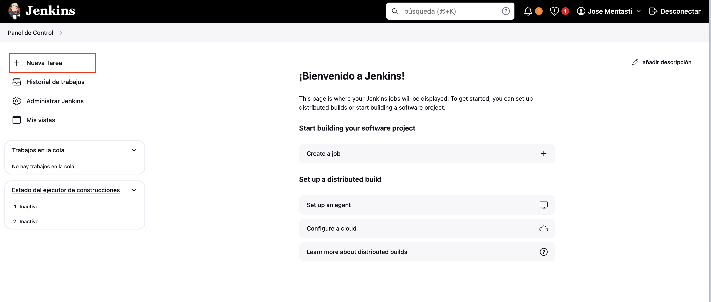

Luego, darle un nombre a la tarea (como `tpe`) y elegir la opción de _Pipeline_.

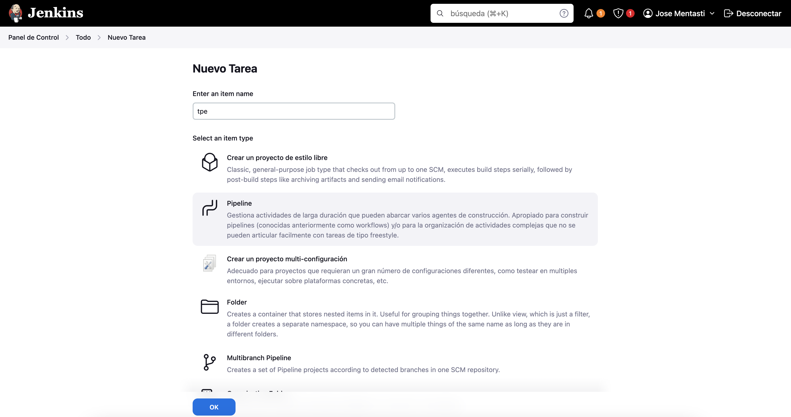

Después, en la pantalla de configuración del pipeline:
- Elegir la opción de _GitHub project_ 

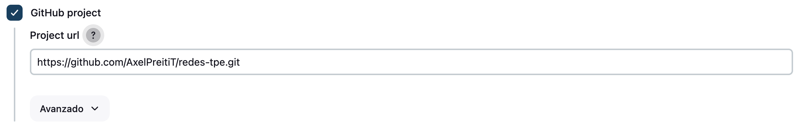

- En la sección de _Build Triggers_, elegir la opción de _GitHub hook trigger for GITScm polling_ para configurar luego el Webhook utilizado para iniciar el pipeline. 

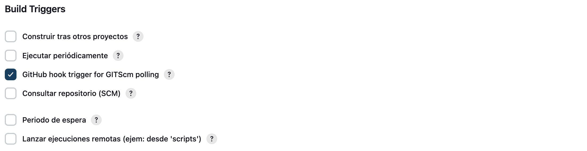

- En la sección de _Pipeline_
    1. En _Definition_, elegir la opción de _Pipeline Script from SCM_. 
    2.  _SCM_, elegir la opción de _Git_
    3. En _Repository URL_, agregar la URL al repositorio
    4. En _Credentials_, elegir las credenciales creadas en [la configuración de Jenkins](Jenkins.md#github) para poder acceder al repositorio.
    5. En _Branches to build_, especificar que queremos ejecutar el pipeline sólo para commits en la branch `main`
    con el valor `*/main`
    6. En la opción de _Script Path_, especificar que el pipeline estará definido en el archivo _Jenkinsfile_ en la raíz del proyecto con el valor `Jenkinsfile`

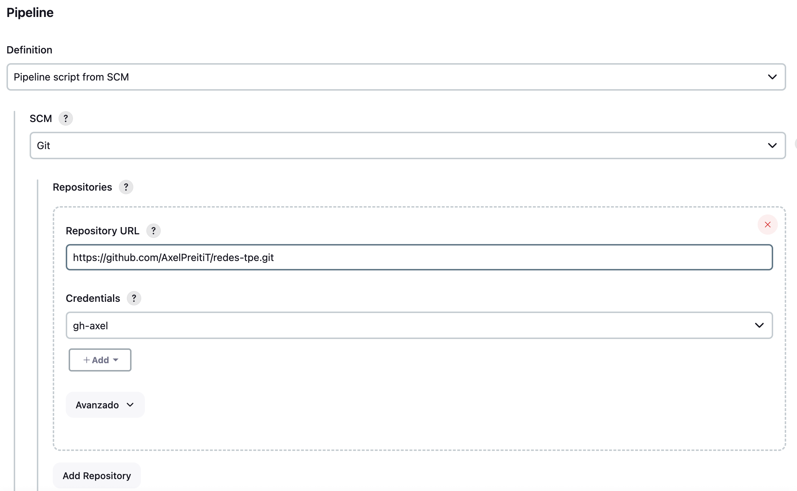
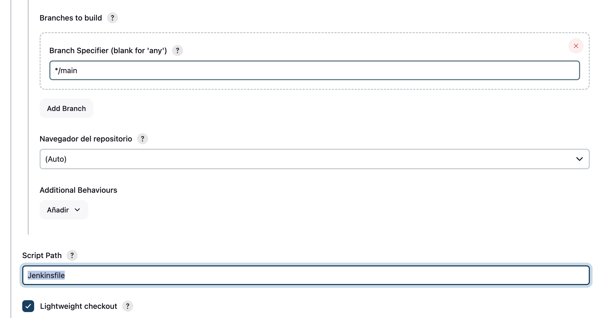

## Pipeline para PR's

Para configurar un pipeline que se corra en todos los Pull requests a la branch `main`, se debe configurar una nueva tarea de Jenkins en el Panel de Control.

Luego, darle un nombre a la tarea (como `tpe-pr`) y elegir la opción de _Multibranch Pipeline_.

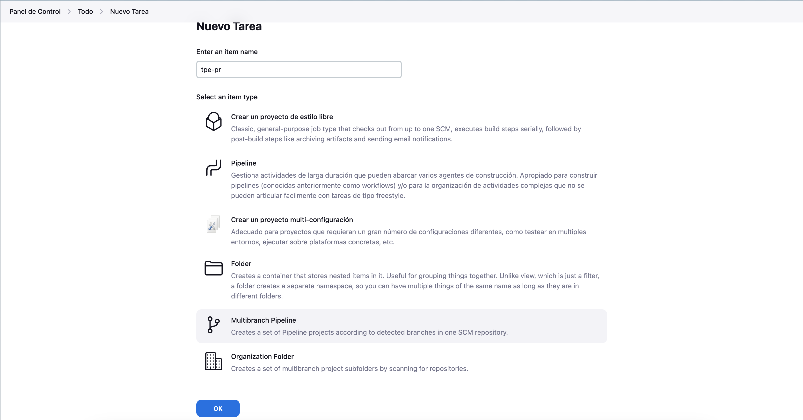

Después, en la configuración del pipeline:
1. En _Branch Sources_, hacer click en _Add Source_

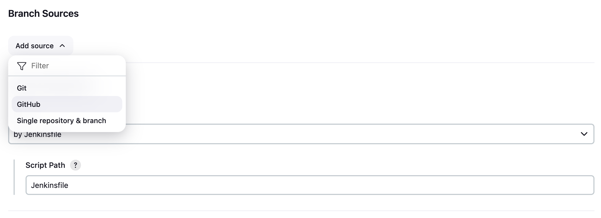

2. En _Credentials_ elegir el id de las credenciales para el repositorio de Github creadas en la [configuración de Jenkins](Jenkins.md#github) y configurar la URL del repositorio. 

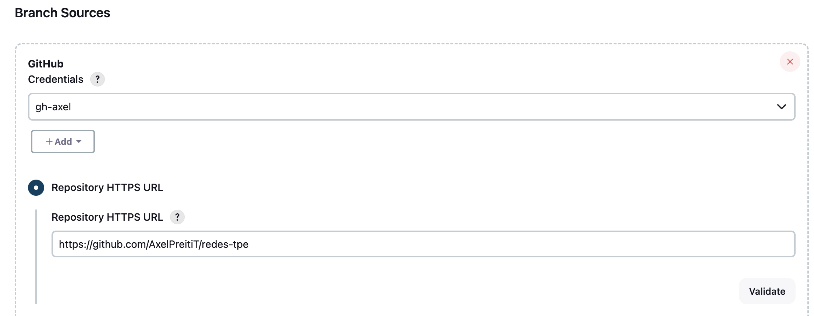

3. En la sección de _Behaviours_ , para la opción de _Discover pull requests from origin_ elegir la opción de _Merging the pull request with the current target branch version_ de las opciones para _Strategy_. Luego, eliminar las otras opciones.

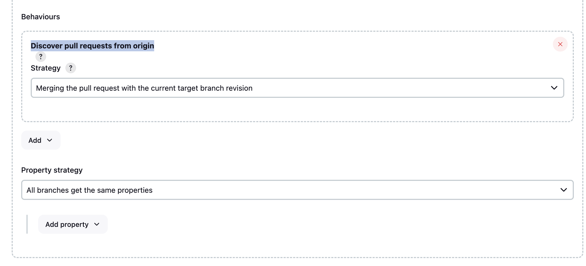

4. En la sección de _Build Configuration_, elegir la opción de _by Jenkinsfille_ y seleccionar el path con la declaración del pipeline (en este caso, `JenkinsfilePR`)

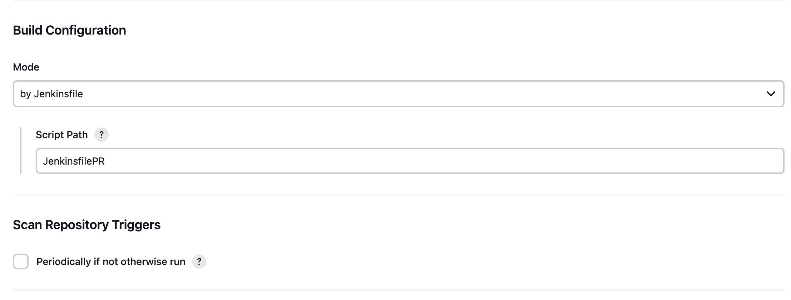

## Webhook 

Aprovechando el plugin de Github de Jenkins y el soporte de la plataforma para el uso de un Webhook, se puede hacer que los pipelines se corran inmediatamente luego de los cambios en el repositorio sin hacer polling. 

#### Configuración en Jenkins

Primero, en la configuración de Jenkins, en Panel de Control > Administrar Jenkins > System (o en `<jenkins_url>/manage/configure`) ir a la sección de _GitHub_ y seleccionar momentáneamente la opción de _Specify another hook URL for GitHub configuration_

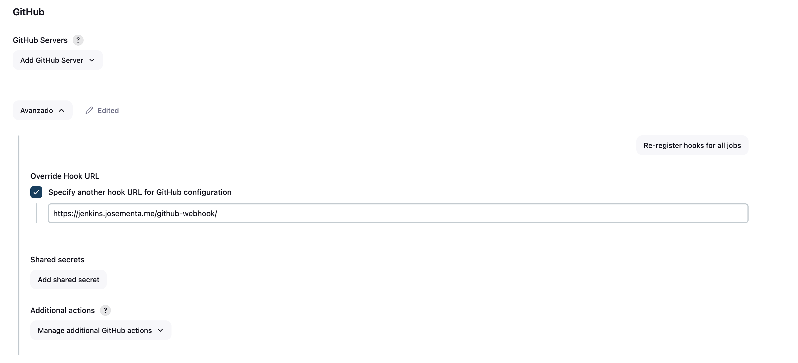

Luego, copiar el URL indicado (`<jenkins_url>/github-webhook/`) y desmarcar la opción (vamos a usar el default).

#### Configuración en Github

Ir a la pestaña de _Settings_ en el repositorio, y seleccionar la opción de _Webhooks_ del proyecto. 

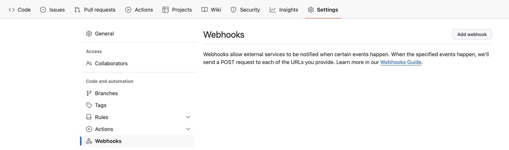

Hacer click en el botón _Add webhook_ para configurar un nuevo Webhook para las tareas de Jenkins y luego:
- Completar el campo _Payload URL_ con el valor obtenido en el paso [anterior](Pipeline#configuración-en-jenkins)
- Dejar para _Content type_ la opción de _application/x-www-form-urlencoded_
- Dejar el campo _Secret_ vacío
- Para la opción de _Which events would you like to trigger this webhook?_, seleccionar la opción de _Let me select individual events._ y seleccionar las opciones de (TODO preguntar axel):
    - Pushes
    - Pull requests
- Mantener la opción de _Active_ 

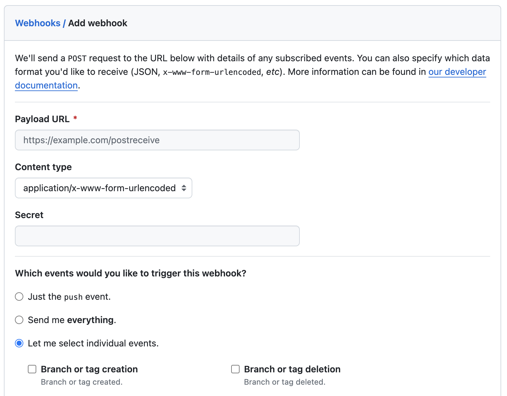
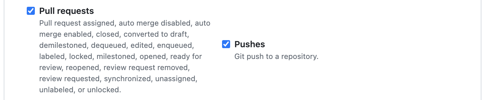
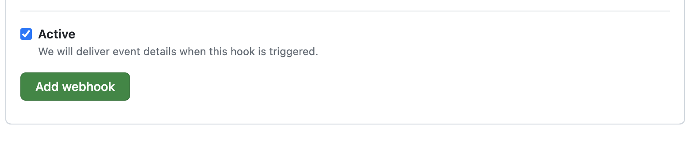