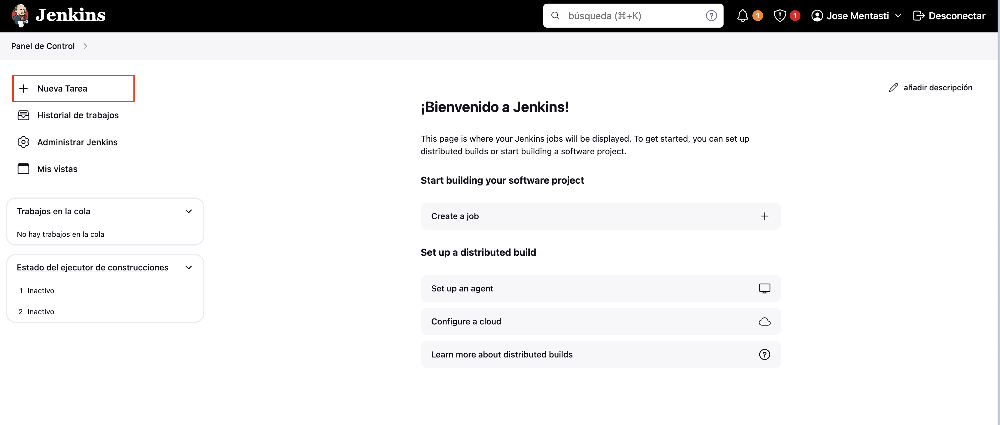
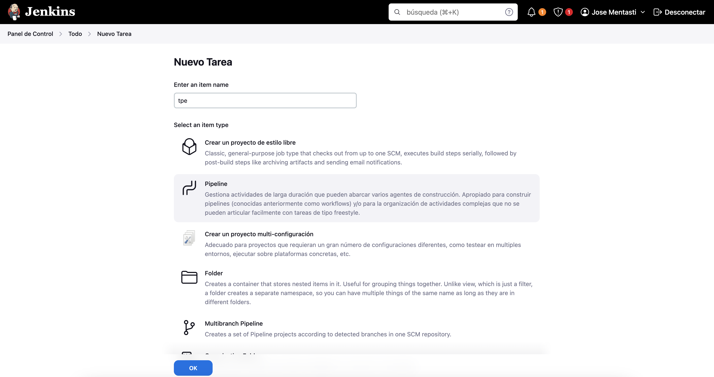
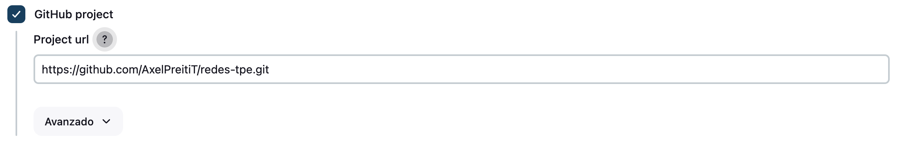
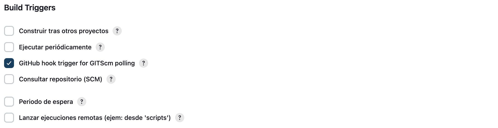
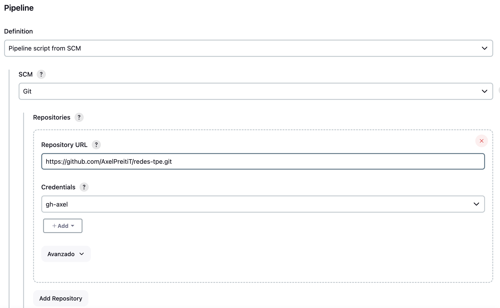
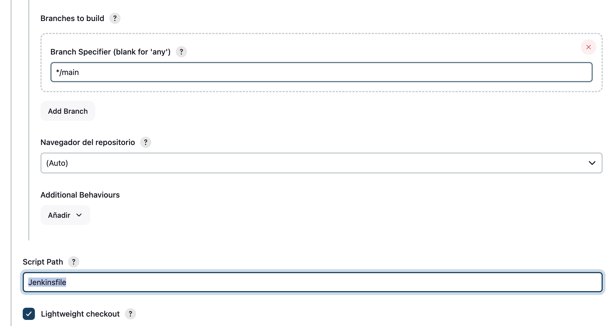

# Configuración del pipeline

Luego de configurar el servidor de Jenkins, podemos empezar a configurar los pipelines para el proyecto.

## Pipeline para main branch

Para configurar el pipeline encargado de buildear, testear y finalmente hacer el deploy del proyecto, se debe configurar una nueva tarea de Jenkins en el Panel de Control.

Luego, darle un nombre a la tarea (como `tpe`) y elegir la opción de _Pipeline_.

Después, en la pantalla de configuración del pipeline:
- Elegir la opción de _GitHub project_ 

- En la sección de _Build Triggers_, elegir la opción de _GitHub hook trigger for GITScm polling_ para configurar luego el Webhook utilizado para iniciar el pipeline. 

- En la sección de _Pipeline_
    1. En _Definition_, elegir la opción de _Pipeline Script from SCM_. 
    2.  _SCM_, elegir la opción de _Git_
    3. En _Repository URL_, agregar la URL al repositorio
    4. En _Credentials_, elegir las credenciales creadas en la configuración de Jenkins para poder acceder al repositorio.
    5. En _Branches to build_, especificar que queremos ejecutar el pipeline sólo para commits en la branch `main`
    con el valor `*/main`
    6. En la opción de _Script Path_, especificar que el pipeline estará definido en el archivo _Jenkinsfile_ en la raíz del proyecto con el valor `Jenkinsfile`

## Pipeline para PR's
